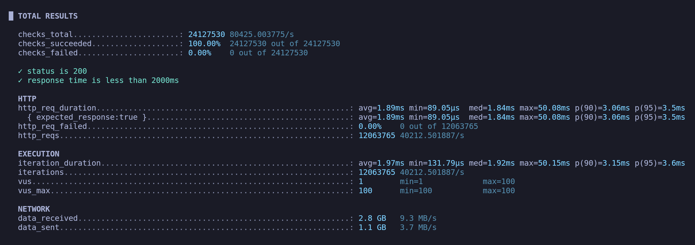
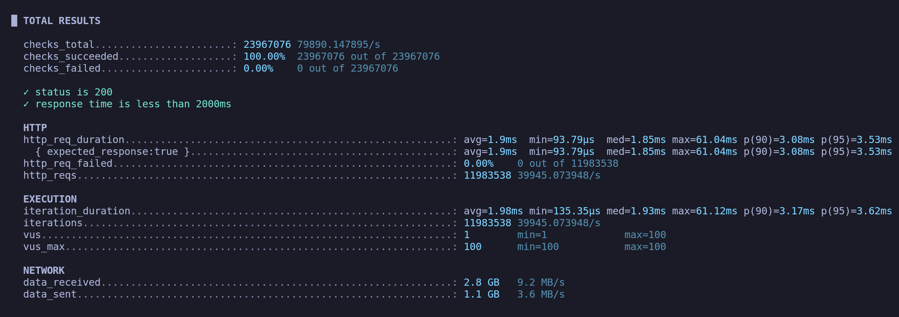
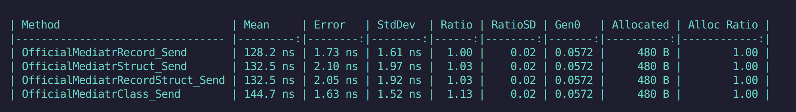
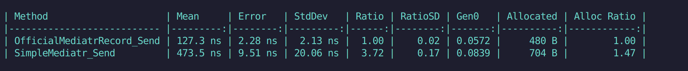

# mediator-benchmarks
small testing repo for benchmarking custom and well-known mediator libraries

## Testing Simple Mediator vs the Official in api request/sec

### Official Mediator library request/sec

### Simple Mediator library requests/sec

 

## Testing types as requests

 

## Testing implementations vs Official

